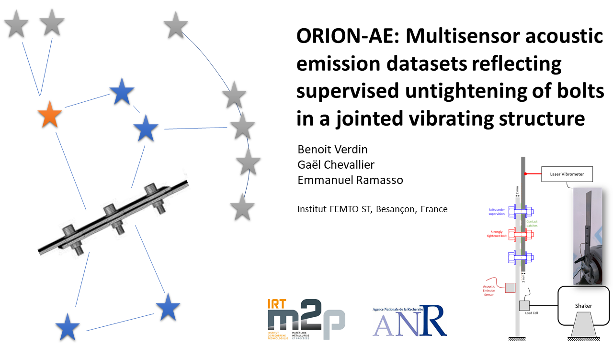

# About

Here are some codes to read the ORION-AE datasets available on the following DATAVERSE repository: https://doi.org/10.7910/DVN/FBRDU0. 

ORION is a test rig called used for vibration damping studies developed by [Gaël Chevallier at FEMTO-ST institute](https://www.femto-st.fr/fr/personnel-femto/gaelchevallier). It was used for generating unique datasets made of multisensor acoustic emission measurements and laser vibrometer to reflect supervised untightening of bolts in a jointed vibrating structure.

Experiments were designed to reproduce the loosening phenomenon observed in aeronautics, automotive or civil engineering structures where parts are assembled together by means of bolted joints. The bolts can indeed be subject to self-loosening under vibrations. Therefore, it is of paramount importance to develop sensing strategies and algorithms for early loosening estimation. The test rig was specifically designed to make the vibration tests as repeatable as possible.

The dataset ORION-AE is made of a set of time-series measurements obtained by untightening a bolt with seven different levels. The data have been sampled at 5 MHz on four different sensors, including three permanently attached acoustic emission sensors in contact with the structure, and one laser (contactless) measurement apparatus. This dataset can thus be used for performance benchmarking of supervised, semi-supervised or unsupervised learning algorithms, including deep and transfer learning for time-series data, with possibly seven classes. This dataset may also be useful to challenge denoising methods or wave-picking algorithms, for which the vibrometer measurements can be used for validation. [For more details, see...](https://doi.org/10.7910/DVN/FBRDU0)

# Details of the folders and files

There is 1 folder per campaign, each composed of 7 subfolders corresponding to 7 tightening levels: 5 cNm, 10 cNm, 20 cNm, 30 cNm, 40 cNm, 50 cNm, 60 cNm. So, 7 levels are available per campaign, except for campaign C for which 40 cNm is missing. There is about 10 seconds of continuous recording of data per level (the exact value can be found according to the number of files in each subfolder). The sampling frequency was set to 5 MHZ on all channels of a picoscope 4824 and a preamplifer of 60 dB (model 2/4/6 preamplifier made by Europhysical acoustics). The characteristics of both the picoscope and preamplifier are provided in the enclosed documentation. Each subfolder is made of .mat files. There is about 1 file per second (depending on the buffering, it can vary a little). The files in a subfolder are named according to the timestamps (time of recording). Each file is composed of vectors of data named:
* A = micro80 sensor.
* B = F50A sensor.
* C = micro200HF sensor.
* D = velocimeter.

Note that the measurements are stored in mV.
The Matlab codes in this Github repo are provided to read the files and more is to come.
